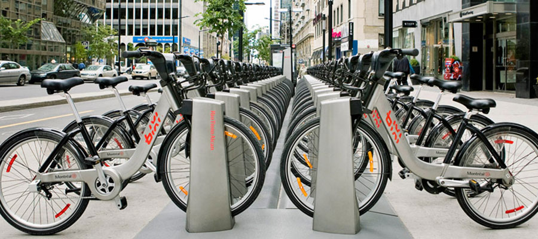
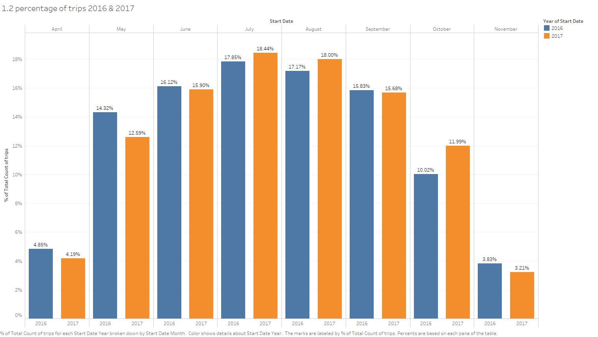
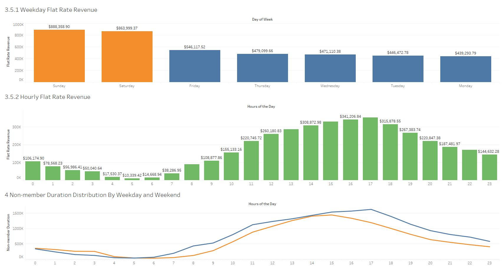
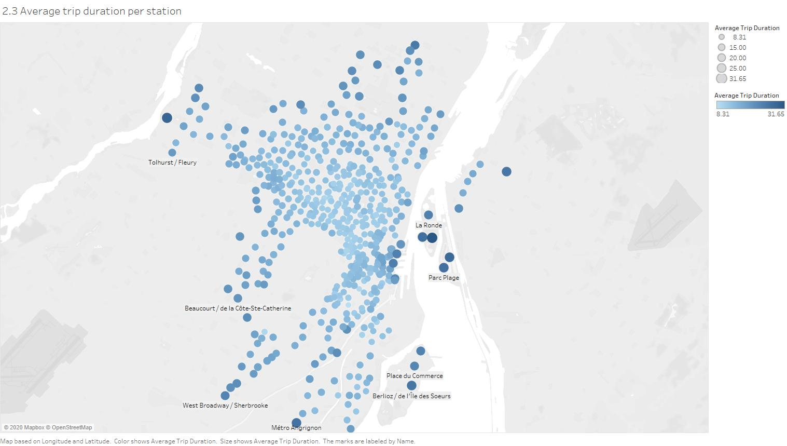

# Bike-sharing system (Data Analysis and Data Visualization)



------

- Data Analysis of the real-world data (8.5 M Rows in one table) using SQL queries on MySQL workbench.

  ```sql
  -- 1.1 The total number of trips for the years of 2016.
  -- Look at the total count of trips grouped by year 2016
  SELECT 
      YEAR(start_date), COUNT(*) AS total_num
  FROM
      trips
  WHERE
      YEAR(start_date) = 2016
  GROUP BY YEAR(start_date);
  -- Get total number: 3917401 from running the query.
  
  -- works without group by
  SELECT 
      YEAR(start_date), COUNT(*) AS total_num
  FROM
      trips
  WHERE
      YEAR(start_date) = 2016;
      
  -- Using Having instead of where
  SELECT 
      YEAR(start_date) AS myyear, COUNT(*) AS total_num
  FROM
      trips
  GROUP BY YEAR(start_date)
  HAVING myyear = 2016;
  ```

  ```sql
  -- 1.2 The total number of trips for the years of 2017.
  -- Look at the total count of trips grouped by year 2017
  SELECT 
      YEAR(start_date), COUNT(*)
  FROM
      trips
  WHERE
      YEAR(start_date) = 2017
  GROUP BY YEAR(start_date);
  -- Get total number: 4666765 from running the query.
  ```

  ```sql
  SELECT 
  	YEAR(start_date) AS myYear,
  	MONTH(start_date) AS myMonth,
  	COUNT(*) AS Trip_Counts
  FROM
  	trips
  GROUP BY myYear , myMonth
  having myYear = 2016;
  ```

  

- Some of the Data Visualization and Dashboards from Tableau with key insights into revenue and business growth.

1. 

   According to this graph, the monthly usage proportion in most months are quite equivalent, only May and October are a little bit different. In May 2016, the proportional usage was higher than 2017. In October 2016, the number was lower than 2017. It may suggest that in 2016 the spring and winter came earlier than 2017.


2. 

   With this dashboard, you’re able to check the flat rate revenue and hourly duration from the non-members by selecting the weekday. You also can see at a certain time how much revenue is generated across the day of the week and how long the duration is on weekday or weekend. Last but not least, you can select a certain time from weekday or weekend to see how much the revenue is made by which day of the week and what time of the day.


3. 

   This map gives up the information about the average trip duration per station across the city. The light blue dots represent the short duration. The color getting darker means the duration is getting longer. Most of the dots are on the west side of the river. Some dark dots are on the islands. It might be because these islands are parks, people want to spend more time in the park. Some other dark dots are along the river bank in the downtown area. There could be a lot of tourist sites along the river. Some other dots are far away from the down town area. This may suggest that the public transportation system at those areas are not fully covered or not well developed. Another possible reason is that Bixi bikes stations are not as dense as they are in downtown. Those light blue dots are concentrated in the downtown area because the city center is the place where people work and live most frequently.
